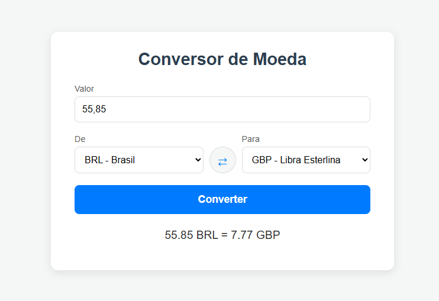

# Conversor de Moedas

Este é um projeto simples de um conversor de moedas, desenvolvido como parte da aula 8 da disciplina Desenvolvimento Web III da Fatec. 
A aplicação utiliza uma interface web para capturar o valor, a moeda de origem e a moeda de destino, e realiza a conversão utilizando dados consumidos da [ExchangeRate-API](https://www.exchangerate-api.com/).  



---

## Tecnologias Utilizadas

- **Backend:** Node.js, TypeScript , Express.js 
- **Frontend:** HTML, CSS, JavaScript 
- **API:** ExchangeRate-API 
- **Ferramentas:** Axios , Dotenv , ts-node-dev 

## Pré-requisitos
- Node.js instalado
- npm (geralmente instalado com o Node.js)
- Uma chave de API da ExchangeRate-API 

## Instalação e Execução

### 1. Clone o repositório:
```Bash
git clone https://github.com/GabrielFrois/conversor-de-moedas.git
```

### 2. Acesse o diretório do projeto:
```Bash
cd conversor-de-moedas
```

### 3. Instale as dependências:
```Bash
npm install
```

### 4. Configure a Chave da API:
- Este projeto precisa de uma chave da ExchangeRate-API para funcionar. É necessário se cadastrar gratuitamente no site para obter a sua.
- Na raiz do projeto, crie um arquivo chamado `.env`.
- Dentro deste arquivo, adicione a sua chave, como no exemplo abaixo:
```bash
API_KEY=Sua_Chave_Aqui
```

### 5. Execute o projeto:
```Bash
npm run dev
```

### Acesse a aplicação em http://localhost:3000.
